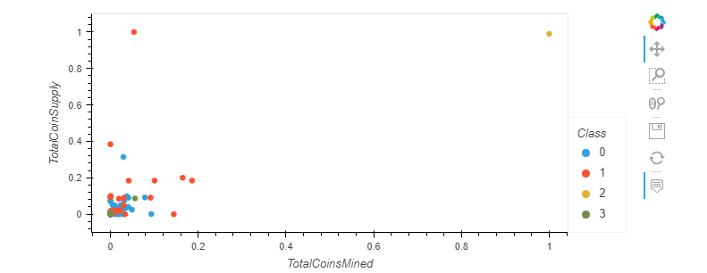

# Unsupervised Machine Learning analysis of Cryptocurrencies

## Overview

The purpose of this project is to provide a report to an investment banking firm including the analysis of tradable cryptocurrencies. This was accomplished by reducing the data dimensions with PCA and then using a clustering method &  K-Means. The results were displayed by creating visualizations using hvplot. Before the analysis, I completed some pre-processing of the data so that it was suitable and would work with machine learning models. This was accomplished mostly using the PANDAS library.

## Results

Please see the below dataframe after being pre-processed. 

Here are the results of the PCA, when reducing the number of features to 3. 

The elbow curve helped identify the ideal number for K, 4. 

Scatter plot of the data after being scaled and clustered. 

